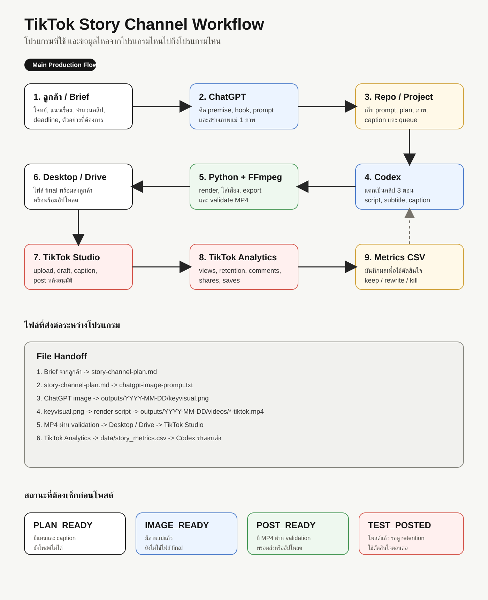
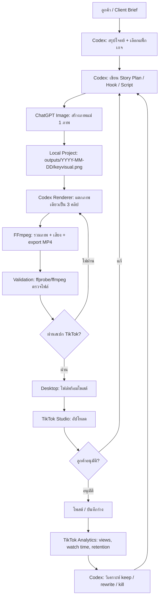
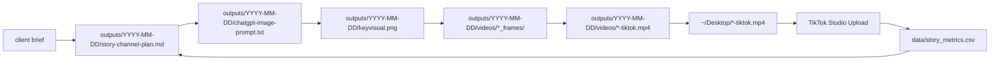

# Client Program Flow

เอกสารนี้อธิบายว่า workflow ผลิตคลิป TikTok ใช้โปรแกรมอะไรบ้าง และข้อมูลไหลจากโปรแกรมไหนไปถึงโปรแกรมไหน

## ภาพ Workflow



## ภาพรวมแบบสั้น

```text
ลูกค้า/Brief
-> ChatGPT สร้างไอเดีย + prompt + ภาพ
-> Codex จัดไฟล์ + เขียน script + render คลิป
-> FFmpeg ตรวจและ export MP4
-> Desktop เก็บไฟล์พร้อมส่ง/พร้อมโพสต์
-> TikTok Studio อัปโหลด/โพสต์
-> TikTok Analytics เก็บ retention
-> Codex วิเคราะห์ผลและทำตอนต่อ
```

## Workflow Diagram



## โปรแกรมที่ใช้

| ขั้นตอน | โปรแกรม | ใช้ทำอะไร | Output |
|---|---|---|---|
| รับงาน | Chat / Google Form / ข้อความลูกค้า | เก็บ brief, เป้าหมาย, ตัวอย่าง, deadline | client brief |
| วางแผน | Codex | แตกโจทย์เป็น premise, hook, script, caption, queue | `story-channel-plan.md` |
| สร้างภาพ | ChatGPT Image | สร้างภาพแม่ 1 ภาพแนว realistic / found-footage | `keyvisual.png` |
| เก็บงาน | Local Project / Repo | จัดเก็บ prompt, ภาพ, script, output | `outputs/YYYY-MM-DD/` |
| ทำคลิป | Codex + Python renderer | แตกภาพเดียวเป็น 3 คลิปด้วย zoom/pan/subtitle/sound | frame sequence |
| Export | FFmpeg | รวมภาพและเสียงเป็น TikTok-ready MP4 | `.mp4` |
| ตรวจไฟล์ | FFmpeg / FFprobe | ตรวจว่าไฟล์เล่นได้และสเปกถูก | validation result |
| ส่งไฟล์ | Desktop / Drive | วางไฟล์ final ให้ลูกค้าหรือให้เราอัปโหลด | ready-to-post MP4 |
| โพสต์ | TikTok Studio | อัปโหลด, ใส่ caption, post/draft | TikTok post |
| วัดผล | TikTok Analytics | ดู retention, views, comments, shares | metrics |
| ปรับรอบถัดไป | Codex | ตัดสินใจทำต่อ, เปลี่ยน hook, หรือเปลี่ยน premise | next plan |

## File Flow



## สถานะงาน

| Status | ความหมาย | ส่งลูกค้าได้ไหม | โพสต์ได้ไหม |
|---|---|---:|---:|
| `BRIEF_READY` | มีข้อมูลลูกค้าแล้ว | ไม่ | ไม่ |
| `PLAN_READY` | มีแผน, prompt, caption | ส่งให้อนุมัติ concept ได้ | ไม่ |
| `IMAGE_READY` | มีภาพแม่แล้ว | ส่งให้ดู mood ได้ | ไม่ |
| `POST_READY` | มี MP4 ผ่าน validation | ใช่ | ใช่ |
| `TEST_POSTED` | โพสต์ตอนแรกแล้ว | ใช่ | รอผล |
| `RESULT_REVIEWED` | วิเคราะห์ retention แล้ว | ใช่ | ทำรอบต่อ |

## Workflow สำหรับขายลูกค้า

```text
1. รับ brief ลูกค้า
2. สร้าง concept 1 ชุด
3. สร้างภาพแม่ 1 ภาพ
4. ทำคลิป 3 ตอนจากภาพเดียว
5. ส่ง preview ให้ลูกค้าอนุมัติ
6. แก้ตามรอบที่ตกลง
7. ส่ง MP4 final
8. ถ้าลูกค้าจ้างเพิ่ม ให้ช่วยอัปโหลด/ดู retention
9. ทำรอบต่อจากผล retention
```

## โปรแกรมขั้นต่ำที่ต้องมี

```text
ChatGPT          สร้างภาพ / ช่วยคิด prompt
Codex            จัด workflow / render / ตรวจไฟล์
Python           รัน renderer
FFmpeg/FFprobe   export และ validate MP4
TikTok Studio    อัปโหลดและดู analytics
```

## โปรแกรมเสริม

```text
Canva       ทำ thumbnail หรือ text layout เพิ่ม
CapCut      ตัดต่อ manual / ใส่ voice / ใส่ sound trend
Google Drive ส่งไฟล์ให้ลูกค้า
Notion/Sheet เก็บ brief และ metrics
Higgsfield  ใช้เฉพาะตอนต้องการภาพหรือวิดีโอ AI คุณภาพสูง แต่ต้นทุนสูงกว่า
```
